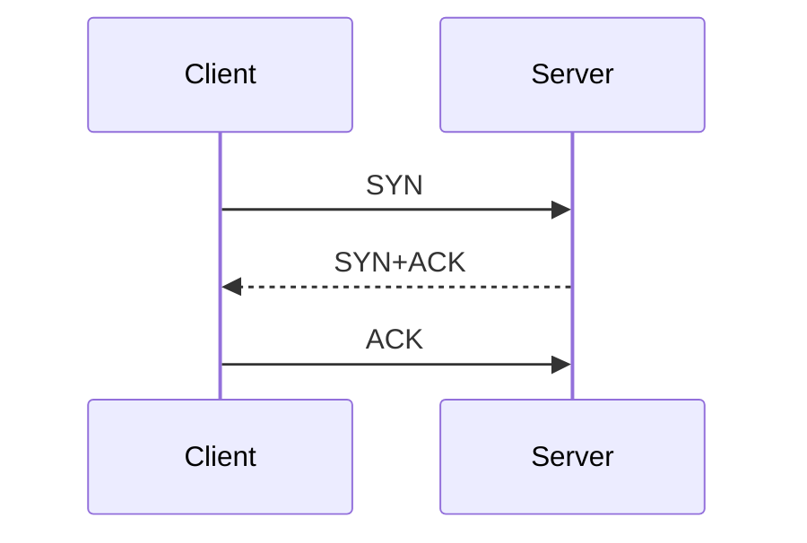
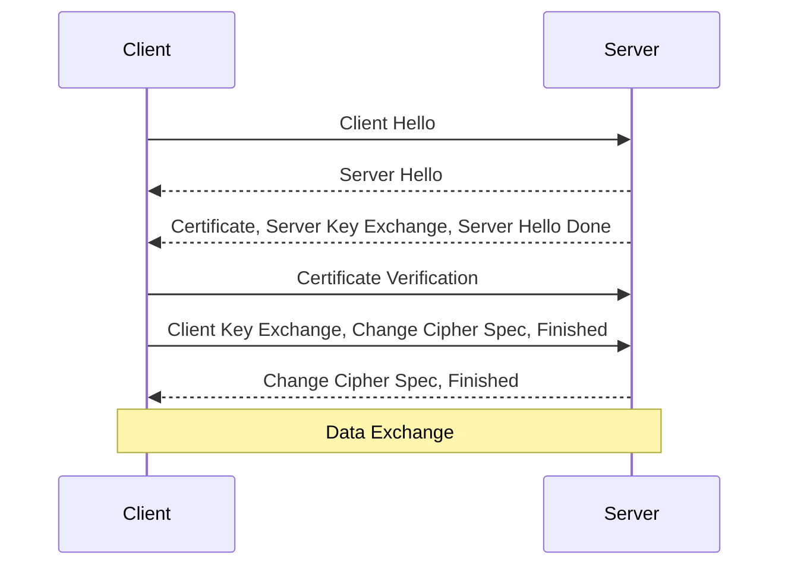
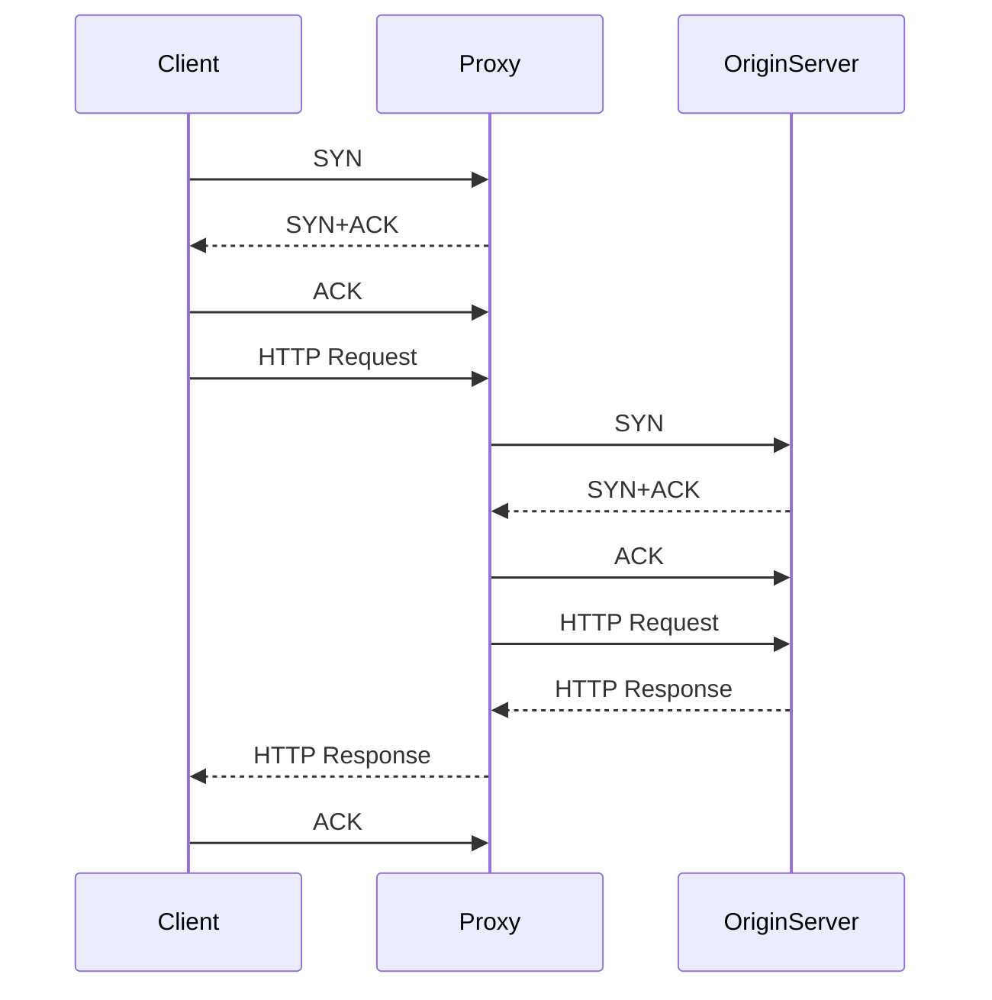
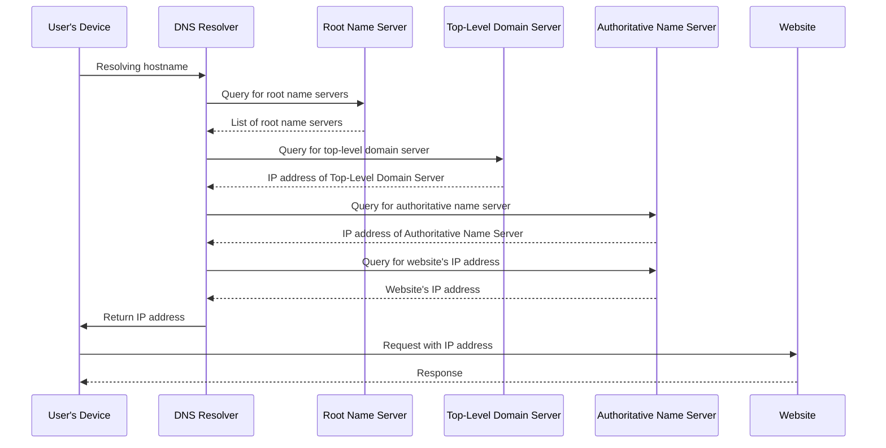
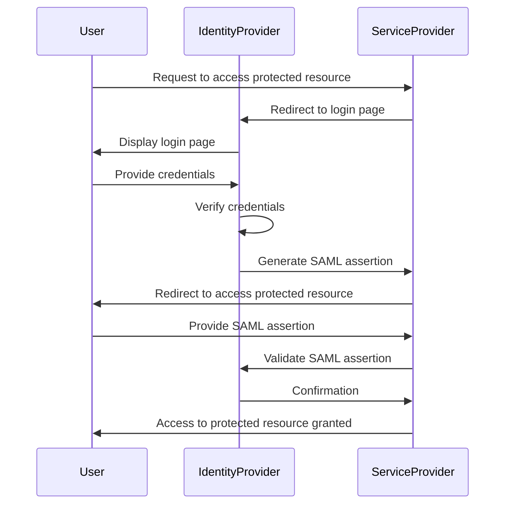

# Swish-Diagrams
Repo for common diagrams we use in Engineering discussions with clients.  Most are created with draw.io or with plantuml in VSCode or another IDE.  Feel free to create your own or submit a request to suggest a new diagram.

## TCP Three Way Handshake Diagram



In this diagram, the client initiates the TCP connection by sending a SYN packet to the server. 
The server responds with a SYN+ACK packet, indicating its willingness to establish a connection. 
Finally, the client sends an ACK packet to acknowledge the server's response, completing the three-way handshake process and establishing a TCP connection between the client and the server.

## HTTPS Diagram



In this diagram, the client initiates the HTTPS connection by sending a Client Hello message to the server, indicating the TLS version and preferred cryptographic algorithms. The server responds with a Server Hello message, sending its certificate, server key exchange message, and server hello done message. 
The client then conducts certificate verification to ensure that the server is authentic. The client generates a random cryptographic key, encrypts it using the server’s public key, and sends it to the server in the Client Key Exchange message along with a Change Cipher Spec message indicating that for all future messages, encryption will used. 
The server responds by also sending a Change Cipher Spec message and encrypted Finished message. If this is correct, the client responds with its own Change Cipher Spec and encrypted Finished message. Once the handshake is completed, both client and server can now exchange data securely. 
You can use the Mermaid syntax to create an HTTPS handshake diagram to track the messages sent between the client and server when establishing a secure connection.

## TCP Proxy Diagram



In this diagram, a client initiates a TCP connection with the proxy (like Cloudflare) by sending a SYN packet. The proxy responds with a SYN+ACK packet, indicating it received the request. The client then acknowledges the proxy's response with an ACK packet. 

Once the TCP connection is established, the client sends an HTTP request to the proxy. The proxy, acting as an intermediary, establishes a separate TCP connection with the origin server (like Apache) by sending a SYN packet. The origin server responds with a SYN+ACK packet, and the proxy acknowledges it with an ACK packet.

Next, the proxy forwards the HTTP request to the origin server, which processes it and generates an HTTP response. The origin server sends the HTTP response back to the proxy. Lastly, the proxy forwards the HTTP response to the client. The client acknowledges the receipt of the response with an ACK packet.

This diagram represents a typical TCP proxied session where the client communicates with a proxy, and the proxy communicates with an origin server, allowing for enhanced security, caching, load balancing, or other reasons to route traffic through a proxy.

## DNS Resolution



This sequence diagram illustrates the process of DNS resolution of a hostname. The user's device communicates with the DNS resolver to resolve the hostname, and the DNS resolver sends queries to the root name server, top-level domain server, and authoritative name server to ultimately obtain the IP address of the desired website. The IP address is then returned to the user's device, which can use it to access the website.


## SAML Authentication



In this diagram, the user initiates a request to access a protected resource on the service provider's website.
The service provider redirects the user to the identity provider's website to initiate the SAML authentication process.
The identity provider displays the login page to the user.
The user provides their login credentials to the identity provider.
The identity provider verifies the user's credentials.
The identity provider generates a SAML assertion, which contains information about the user's identity and authentication status.
The service provider receives the SAML assertion and grants the user access to the protected resource.
The user is redirected back to the service provider's website.
The user provides the SAML assertion to the service provider.
The service provider validates the SAML assertion to make sure it comes from an authentic identity provider.
The identity provider confirms the user's authentication to the service provider.
The service provider grants the user access to the protected resource.


## GenAI Coding Assistanct with AWS Bedrock integration

```mermaid
sequenceDiagram
    title LLM API Transaction Flow: Client IDE -> TabbyML -> AWS Bedrock -> Anthropic Opus Model

    participant Client IDE
    participant TabbyML
    participant AWS Bedrock
    participant Anthropic Opus Model

    Client IDE->>TabbyML: Sends coding assistance request (e.g., code completion, debugging)
    TabbyML->>AWS Bedrock: Forwards request via API integration
    AWS Bedrock->>Anthropic Opus Model: Processes request using Anthropic Opus model
    Anthropic Opus Model-->>AWS Bedrock: Returns generated response (e.g., code suggestions)
    AWS Bedrock-->>TabbyML: Sends processed response back
    TabbyML-->>Client IDE: Delivers AI coding assistance output
