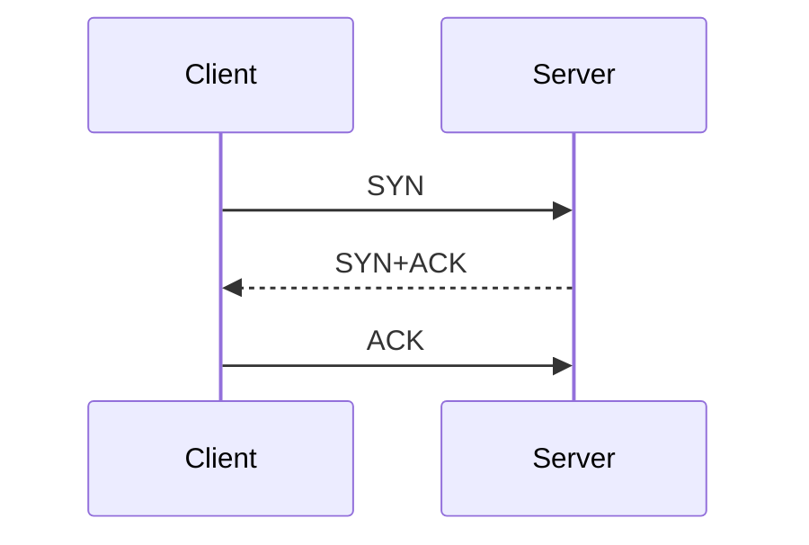

#Useful Daigrams for IT Teams

##TCP Three Way Handshake

```mermaid
sequenceDiagram
    participant Client
    participant Server

    Client->>Server: SYN
    Server-->>Client: SYN+ACK
    Client->>Server: ACK
```

##HTTPS Handshake

